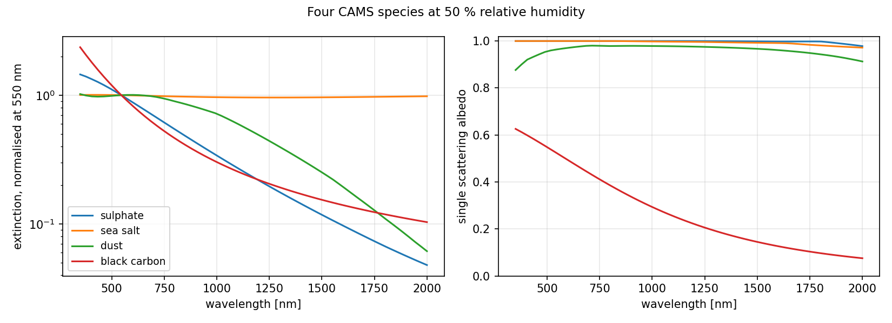
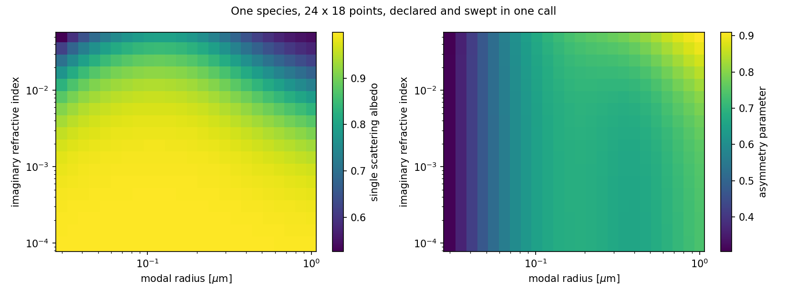

# PyMopsmap

<p align="center">
  
  <a href="https://pixi.sh"></a>
  <a href="https://github.com/astral-sh/ruff"></a>
  <a href="https://pypi.org/project/pymopsmap/"></a>
  <a href="https://github.com/walcark/pymopsmap/blob/main/LICENSE"></a>
  
</p>

A Python wrapper for [MOPSMAP](https://mopsmap.net). Compute aerosol optical
properties with Mie, T-matrix and DDA single-particle scattering. See
[Gasteiger and Wiegner (2018), GMD](https://doi.org/10.5194/gmd-11-2739-2018)
for the model itself.

**[docs/guide.md](docs/guide.md) is the documentation.** What follows is the
short tour.

<p align="center">
  
</p>


## The idea

An aerosol is a description: a size distribution, a refractive index, a shape,
how it responds to water. The conditions around it change, the description
does not. So the description is the object, and the conditions are the call.

```python
import numpy as np
import pymopsmap as pm

aer = pm.Specie.custom(
    pm.Mode(
        shape=pm.shapes.Sphere(),
        psd=pm.psd.LognormalPSD(
            rm=0.12, sigma=1.8, n=1e9, rmin=0.005, rmax=20.0
        ),
        n_real=1.53, n_imag=0.008, density_dry=2.6, kappa=0.2,
    ),
    name="my dust",
)

op = aer.compute(wl=np.linspace(0.4, 2.0, 100), rh=[0, 50, 80])

op.sizes            # {'rh': 3, 'wl': 100}
op["kext"]          # <xarray.DataArray (rh: 3, wl: 100)>
```

The answer is a plain `xarray.Dataset`, with the dimensions you named. Or load
one of the species the package ships:

```python
pm.load(pm.CAMS.DUST)
pm.load(pm.OPAC.WASO)
pm.opac_mix("continental_average")
```

---

## And a description that varies

A modal radius you do not know is not a condition, it is part of the
description. So it goes where the radius goes, as a `DataArray`, and the call
never changes:

```python
pm.psd.LognormalPSD(
    rm=xr.DataArray(np.linspace(0.05, 0.4, 8), dims="rm"),
    sigma=xr.DataArray(np.linspace(1.4, 2.2, 5), dims="sigma"),
    n=1e9, rmin=0.005, rmax=20.0,
)

op = aer.compute(wl=[0.55], rh=[0, 50, 80])
op.sizes            # {'rh': 3, 'rm': 8, 'sigma': 5, 'wl': 1}
```

<p align="center">
  
</p>

The same holds over a scene: a radius that varies from pixel to pixel and a
humidity that varies from pixel to pixel and from hour to hour come back as
`(y, x, t, wl)`, and MOPSMAP runs once per distinct pair.
[docs/guide.md](docs/guide.md) carries on from here.

---

## Installation

```bash
pip install pymopsmap
```

The built-in aerosol catalogue (CAMS, OPAC) ships with the package. Two external
pieces are not bundled:

| Piece | How to get it |
|---|---|
| MOPSMAP binary | download from [mopsmap.net](https://mopsmap.net), place at `bin/mopsmap/mopsmap` |
| Optical data set | 40 GB in two archives on [Zenodo](https://zenodo.org/record/1284217); point `PYMOPSMAP_DATASET_SOURCE` at the directory, or at an HTTP base URL to fetch on demand into `~/.cache/pymopsmap/` |

```bash
export PYMOPSMAP_DATASET_SOURCE=/path/to/optical_dataset
python -c "import pymopsmap as pm; print(pm.load(pm.CAMS.SULPHATE))"
```

For development:

```bash
git clone https://github.com/walcark/pymopsmap.git
cd pymopsmap
pixi install -e dev
```

## Where to go next

| | |
|---|---|
| [docs/guide.md](docs/guide.md) | the documentation: the catalogue, saving a species, every output, humidity, mixtures, measured particles, and what the library cannot do |
| [docs/validation.md](docs/validation.md) | the reproduction of the reference article, figure by figure |
| [docs/api-v2-spec.md](docs/api-v2-spec.md) | the NetCDF schema a species is written in |

---

## Validation

Nine figures and four tables of
[Gasteiger and Wiegner (2018)](https://doi.org/10.5194/gmd-11-2739-2018), the
MOPSMAP article, are recomputed through this wrapper. 92 published values are
asserted in `tests/validation/`, which also checks the same pipeline against
`miepython`.

<p align="center">
  
</p>

## Roadmap

- **Growable sweeps**: a store holds one grid, so widening a request today
  recomputes it rather than extending what is already there.
- **Transparent remote dataset**: automatic download of the optical dataset
  when `PYMOPSMAP_DATASET_SOURCE` is not set, removing the manual setup step.
- **Tabulated OPAC**: the wet state published by GEISA, alongside the kappa
  flavour that ships today. The GEISA file host was decommissioned during the
  migration of the database, so the links on its pages no longer resolve.

## How the repository is laid out

```
src/pymopsmap/     the library
  species/         Specie, Mode, Mix, the NetCDF schema, the catalogue
  shapes.py        Sphere, Spheroid, Irregular, and the rest
  psd.py           LognormalPSD, ModifiedGammaPSD, and the rest
  microparams.py   one validated point, rendered to MOPSMAP commands
  engine/          one point, one MOPSMAP run, and the output rules
  sweep.py         a parameter space to points, and the xsweep binding
  scatlib/         the optical data set: resolve, download, cache
  accessors.py     the .mopsmap accessor on a result
  data/            the species catalogue the wheel ships

tests/
  unit/            nothing but the package, MOPSMAP stubbed
  integration/     the binary and the data set, end to end
  validation/      the published numbers of the reference article
  data/            fixtures, not the library's data

scripts/           none of it is imported by the package
  build_catalog/   builds src/pymopsmap/data
  validation/      redraws the article's figures
  demo/            draws the guide, and sweeps a real CAMS scene

docs/
  guide.md         the documentation
  validation.md    what agrees with the article, and what does not
  api-v2-spec.md   the NetCDF schema a species is written in
  figures/         committed, and regenerated by scripts/

bin/mopsmap/       the MOPSMAP distribution: binary, source, data, examples
```

Three levels, and only the first and third are usually in your way.

| Level | Object | Role |
|---|---|---|
| Description | `Specie` | the parameter space, from a file or built in Python |
| Point | `MicroParameters` | one concrete, validated point of it |
| Combination | `Mix` | species weighted into an external mixture |

`tests/README.md` and `scripts/README.md` say what each directory needs and
what it proves.

## Development

```bash
pixi run -e dev test              # unit, no data set needed
pixi run -e dev test-integration  # the pipeline end to end
pixi run -e dev test-validation   # against the published article
pixi run -e dev all               # fmt + lint + type-check + test
```

`tests/README.md` says what each directory needs and proves, and
`scripts/README.md` what each script produces.
