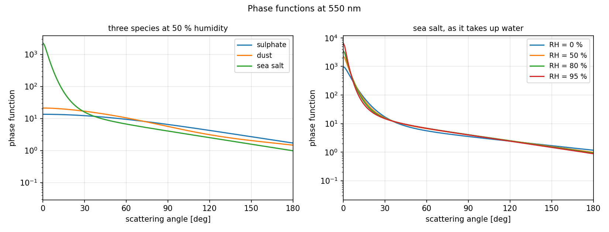
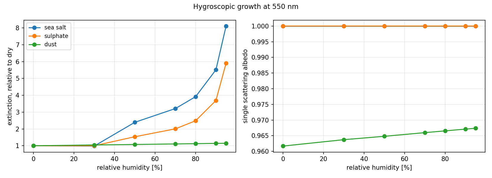
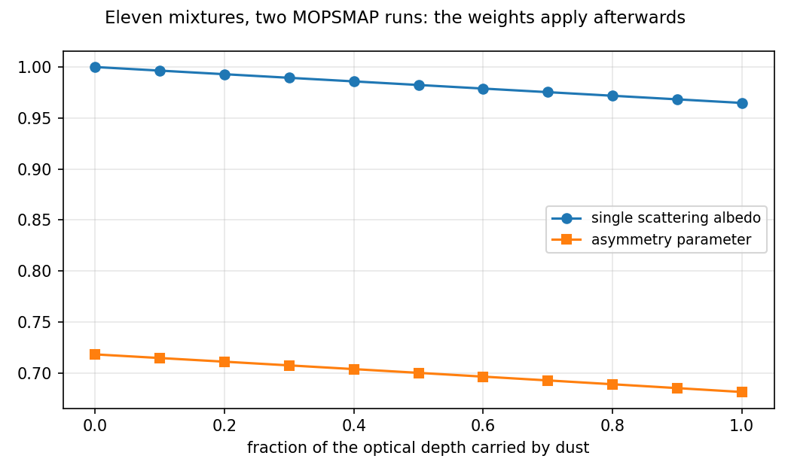

# pymopsmap, a guide

**MOPSMAP** computes aerosol optical properties: phase function, scattering
and absorption coefficients, and the rest. It is a Fortran program that reads
a text file and interpolates a 40 GB table of pre-computed single-particle
scattering. **pymopsmap** turns a description of an aerosol into that text
file, and the Fortran output back into labelled arrays.

- [The idea](#the-idea)
- [One aerosol, many conditions](#one-aerosol-many-conditions)
- [A description that varies too](#a-description-that-varies-too)
- [Naming an axis](#naming-an-axis)
- [A scene](#a-scene)
- [What xsweep brings](#what-xsweep-brings)
- [The catalogue](#the-catalogue)
- [Saving and reading](#saving-and-reading)
- [What comes back](#what-comes-back)
- [Humidity](#humidity)
- [Mixtures](#mixtures)
- [Measured particles](#measured-particles)
- [What it cannot do](#what-it-cannot-do)
- [Is it right](#is-it-right)

---

## The idea

An aerosol is a description: a size distribution, a refractive index, a shape,
how it responds to water. That description does not change when the conditions
around it do:

- the air it sits in, through relative humidity,
- the wavelength it is looked at,
- where and when it is.

So the description is the object, and the conditions are the call.

```python
import numpy as np
import pymopsmap as pm

aer = pm.Specie.custom(
    pm.Mode(
        shape=pm.shapes.Sphere(),
        psd=pm.psd.LognormalPSD(
            rm=0.12, sigma=1.8, n=1e9, rmin=0.005, rmax=20.0
        ),
        n_real=1.53,
        n_imag=0.008,
        density_dry=2.6,
        kappa=0.2,
    ),
    name="my dust",
)
```

Eight numbers and a shape. That is the whole aerosol, and nothing in it
mentions a wavelength or a humidity.

---

## One aerosol, many conditions

```python
op = aer.compute(wl=np.linspace(0.4, 2.0, 100), rh=[0, 50, 80])

op.sizes            # {'rh': 3, 'wl': 100}
op["kext"]          # <xarray.DataArray (rh: 3, wl: 100)>
op["ssa"]
```

The dimensions you asked for come back as the dimensions you named. The answer
is a plain `xarray.Dataset`, so the whole xarray API applies to it: `sel`,
`interp`, `mean`, `to_netcdf`, plotting.


---

## A description that varies too

A modal radius you do not know is not a condition, it is part of the
description. So it goes where the radius goes, as a `DataArray`:

```python
import xarray as xr

aer = pm.Specie.custom(
    pm.Mode(
        shape=pm.shapes.Sphere(),
        psd=pm.psd.LognormalPSD(
            rm=xr.DataArray(np.linspace(0.05, 0.4, 8), dims="rm"),
            sigma=xr.DataArray(np.linspace(1.4, 2.2, 5), dims="sigma"),
            n=1e9, rmin=0.005, rmax=20.0,
        ),
        n_real=1.53, n_imag=0.008, density_dry=2.6, kappa=0.2,
    ),
    name="my dust",
)

aer.swept           # {'rm': 8, 'sigma': 5}

op = aer.compute(wl=[0.55], rh=[0, 50, 80])
op.sizes            # {'rh': 3, 'rm': 8, 'sigma': 5, 'wl': 1}
```

Any numeric field of a mode accepts one: the modal radius, the width, the
bounds, the refractive index, the aspect ratio of a spheroid. Distinct
dimensions multiply, and the call never changes.


---

## Naming an axis

The dimension is yours to name, and its name is what the two parameters have
in common. Put two of them on the **same** dimension and they vary together, a
trajectory rather than a grid:

```python
pm.psd.LognormalPSD(
    rm=xr.DataArray(np.linspace(0.05, 0.4, 8), dims="aging"),
    sigma=xr.DataArray(np.linspace(1.4, 2.2, 8), dims="aging"),
    n=1e9, rmin=0.005, rmax=20.0,
)

aer.swept           # {'aging': 8}
op.sizes            # {'aging': 8, 'wl': 1}
```

Eight points, not forty. An aerosol that coarsens as it ages is one axis, not
two, and saying so is naming the dimension after what it means.

---

## A scene

The same thing holds in two or three dimensions, which is what a satellite
image or a model output is. A size that varies from pixel to pixel, a humidity
that varies from pixel to pixel and from hour to hour:

```python
rm = xr.DataArray(..., dims=("y", "x"))        # (12, 16)
rh = xr.DataArray(..., dims=("y", "x", "t"))   # (12, 16, 4)

aer = pm.Specie.custom(
    pm.Mode(
        shape=pm.shapes.Sphere(),
        psd=pm.psd.LognormalPSD(rm=rm, sigma=1.8, n=1e9, rmin=0.005, rmax=20),
        n_real=1.53, n_imag=0.008, density_dry=2.6, kappa=0.2,
    ),
    name="scene",
)

op = aer.compute(wl=[0.55], rh=rh)
op.sizes            # {'y': 12, 'x': 16, 't': 4, 'wl': 1}
```

768 cells, and MOPSMAP runs 103 times: that is how many distinct pairs of
radius and humidity the scene holds. Nothing in the call says so, and nothing
has to.

## What xsweep brings

The sweep is walked by [xsweep](https://github.com/walcark/xsweep), and four
of its properties are what make a large grid practical.

| | |
|---|---|
| **A store** | results are written to `~/.cache/pymopsmap/sweeps`, keyed on the species description, the grid and the contract. Re-running costs nothing, and a sweep killed halfway resumes from the points it is missing |
| **Deduplication** | a field of a million humidities holding ninety distinct values is ninety MOPSMAP runs |
| **Threads** | MOPSMAP is a subprocess, so the points go out in parallel. `PYMOPSMAP_WORKERS` sets how many; the default is one per core |
| **No silent gaps** | a point that fails raises. It does not become a NaN you discover three figures later |

On a real CAMS scene of 10 320 pixels, 91 distinct humidities, it is 91 runs
and about twenty seconds.

---

## The catalogue

Two sources ship inside the wheel, for when you would rather not type eight
numbers.

```python
pm.load(pm.CAMS.SULPHATE)              # ECMWF CAMS, versions 47r1 to 49r1
pm.load(pm.OPAC.WASO)                  # the ten OPAC components
pm.opac_mix("continental_average")     # the ten OPAC climatologies
```

They answer the same `compute` as a species you build, and carry the same
parameter space: `pm.load(...).swept` is empty, and nothing stops you from
reading one and sweeping a copy of it.

Size distributions: `LognormalPSD`, `ModifiedGammaPSD`, `FixedPSD` for a
single size, `DistrListPSD` for a tabulated one, `FileDefinedPSD` for a file.

Shapes: `Sphere`, `Spheroid`, `SpheroidLognormal`, `SpheroidDistrFile`,
`Irregular` (six shapes from DDA), `IrregularDistrFile`, `IrregularOverlay`.

Two more fields a mode carries, both of which change the particle rather than
the question:

```python
pm.Mode(..., nonabs_fraction=0.5)      # half the particles do not absorb
pm.Mode(..., size_equ="vol")           # a radius is the volume-equivalent one
```

---

## Saving and reading

A species is a NetCDF `DataTree`, one group per mode. Reading one is the same
code path as reading the catalogue, so a species you build round-trips:

```python
aer.to_netcdf("my_dust.nc")
pm.load("my_dust.nc").compute(wl=wl)
```

The schema is in `docs/api-v2-spec.md`, section 4. Adding a source to the
catalogue is writing that schema, not writing code.

---

---

## What comes back

Integrated properties by default. Ask for more by naming them:

```python
op = aer.compute(
    wl=[0.55], rh=50,
    outputs={pm.OutputType.PHASE_FUNCTION, pm.OutputType.SCATTERING_MATRIX},
    n_angles=721,
)
op["phase"]               # (wl, theta)
op["scattering_matrix"]   # (wl, theta, element), element = a1 a2 a3 a4 b1 b2
```



| Request | Variables | Axes |
|---|---|---|
| `INTEGRATED` | `kext`, `ksca`, `ssa`, `g`, `reff`, `n`, `cross_dens`, `vol_dens`, `mass_conc`, three Angstrom exponents | `wl` |
| `LIDAR` | `backscatter`, `lidar_ratio`, `depol_ratio`, `ext_to_mass`, `back_to_mass`, `angstrom_back` | `wl` |
| `PHASE_FUNCTION` | `phase` | `wl, theta` |
| `VOLUME_SCATTERING_FUNCTION` | `vol_sca_func` | `wl, theta` |
| `SCATTERING_MATRIX` | `scattering_matrix` | `wl, theta, element` |
| `COEFF` | `coeff` | `wl, l, coeff_element` |

The integrated block always comes back, whatever you ask for: MOPSMAP writes
it anyway.

---

## Humidity

How a species answers to water is a property of the species, stated in its
file, not a switch at call time.

| `specie.growth` | The file holds | What happens |
|---|---|---|
| `"tabulated"` | wet values on a real `rh` axis | interpolated at your `rh` |
| `"kappa"` | dry values and a hygroscopicity | MOPSMAP grows the particles |
| `"none"` | dry only | passing `rh=` raises |



```python
pm.load(pm.CAMS.SULPHATE).growth      # 'tabulated'
pm.load(pm.CAMS.SULPHATE).rh_range    # (0.0, 95.0)
pm.load(pm.OPAC.WASO).compute(rh=80, wl=wl, kappa=0.3)   # override kappa
```

---

## Mixtures

`Mix` is an external mixture: each species is computed once, and the weights
apply to the results afterwards. Changing a weight costs no MOPSMAP run.



Three currencies express the same weights.

```python
# number concentration, m-3
pm.Mix({pm.CAMS.SULPHATE: 3.2e9, pm.CAMS.SEA_SALT: 1.1e8})

# mass concentration, kg m-3, which is what a transport model gives
pm.Mix.from_mass({pm.CAMS.SULPHATE: 4.1e-9, pm.CAMS.DUST: 2.2e-8})

# fractions of the total optical depth, which is what an inversion gives
pm.Mix.from_optical_depth(
    {pm.CAMS.SULPHATE: 0.30, pm.CAMS.DUST: 0.70}, wl_ref=0.56, rh_ref=50,
)
```

`rh_ref` is required and it is not a convention: optical depth fractions
depend on humidity, because species do not swell alike. The number
concentration is what stays fixed, so your fractions are inverted into
concentrations at `rh_ref` and those are carried. Ask for another humidity and
you get what the same air would look like there, with different fractions.

A composition that varies per pixel costs no extra run, for the same reason:

```python
mix = pm.Mix({pm.CAMS.SULPHATE: sulphate_field, pm.CAMS.DUST: dust_field})
op = mix.compute(wl=[0.55], rh=humidity_field)

op["concentration"]     # (specie, y, x), what the weights resolved to
```

---

## Measured particles

Microscopy gives a size and a shape per particle, not a distribution. Two
constructors turn such a table into the modes MOPSMAP runs.

```python
modes = pm.Mode.from_particles(
    radii=diameters / 2,
    aspect_ratios=1 / minor_over_major,
    n_real=1.53, n_imag=0.0078,
    r_max=47.5,                  # clip rather than drop
)
pm.Specie.custom(modes).compute(wl=wl)
```

Particles of the same size and shape become one mode, and an aspect ratio
between two grid points of the data set is split over both, which is what
MOPSMAP does with an unbinned one. Forty thousand measured particles come out
as a few thousand modes.

The second spreads a mode over a measured distribution of imaginary
refractive indices, which is not the same as giving every particle the
average. Section 5.6 of the reference article shows the difference is a factor
of two on the lidar ratio:

```python
modes = pm.Mode.from_index_distribution(
    n_imag=[0.001, 0.004, 0.016],
    weights=[412, 198, 57],
    n_real=1.53,
    shape=pm.shapes.SpheroidDistrFile(distr_filename="ar_kandler"),
    psd=pm.psd.LognormalPSD(rm=0.1, sigma=2.0, n=1e9, rmin=0.005, rmax=20),
)
```

---

## What it cannot do

Worth knowing before you plan around it.

| | |
|---|---|
| **The data set is 40 GB** | two archives from [Zenodo](https://zenodo.org/record/1284217). The main one covers refractive indices from 1.28 to 1.64; soot reaches 1.75 and needs the extended one |
| **Size parameter has a ceiling** | about 1005 for spheres and spheroids, 30.2 for the irregular shapes. A particle past it is refused, not extrapolated. `CoverageError` and `DomainError` say which |
| **A sweep is all or nothing** | one point outside the coverage fails the grid. Ask each shape for the sizes it has |
| **One size equivalence per run** | MOPSMAP reads a single `size_equ`, so a mixture whose modes disagree is refused |
| **A store holds one grid** | widening a request recomputes it rather than extending what is there |
| **The cost is contributions** | a mode landing between four refractive index grid points, split again by a non-absorbing fraction, is ten NetCDF reads per wavelength. An ensemble of ten thousand modes over fifty wavelengths is an hour |

---

## Is it right

Every table of the reference article is asserted in the test suite, and nine
of its figures are redrawn from this package.

> Gasteiger, J. and Wiegner, M., *MOPSMAP v1.0: a versatile tool for modeling
> aerosol optical properties*, Geosci. Model Dev. 11, 2739-2762, 2018.

`docs/validation.md` says what agrees, to what precision, and what does not,
including three statements of the article that do not hold.

```bash
export PYMOPSMAP_DATASET_SOURCE=/path/to/optical_dataset
pixi run -e dev test-validation
```

`tests/README.md` says what each test directory needs and proves.
