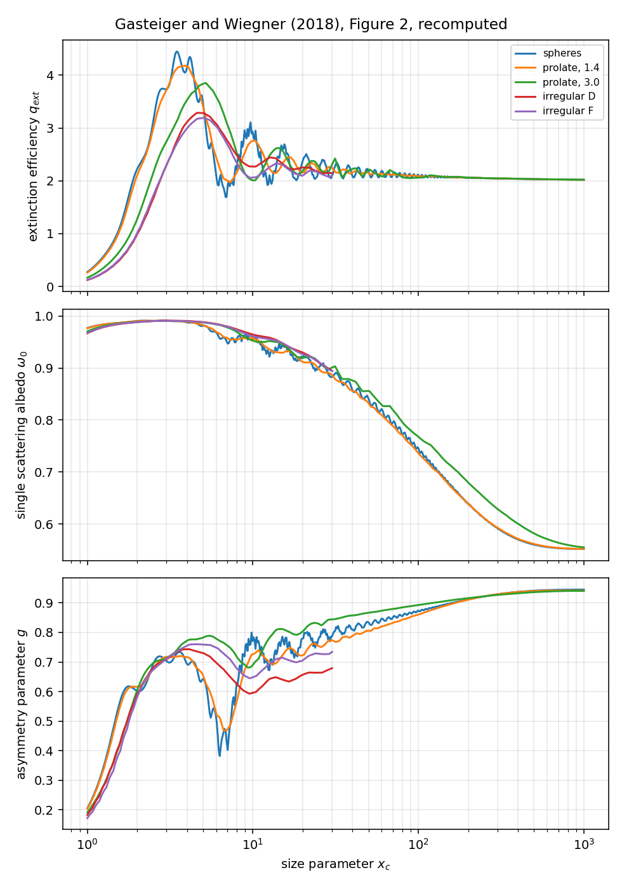
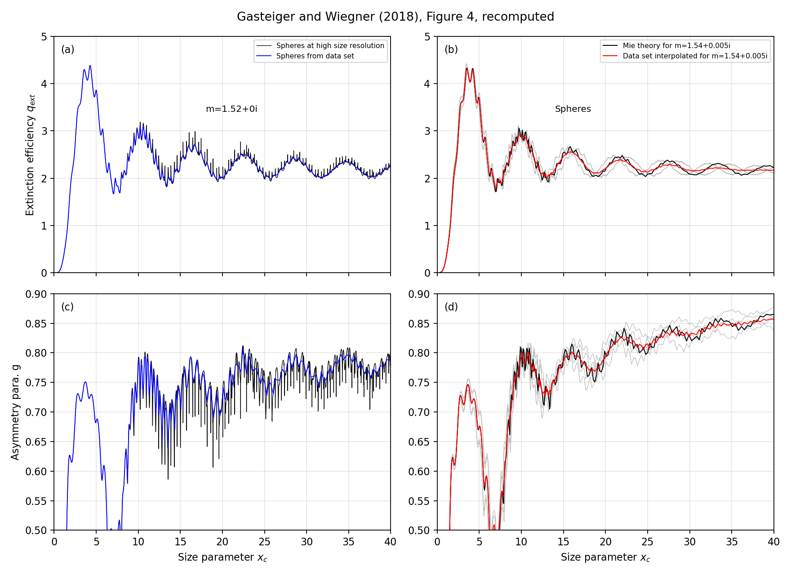
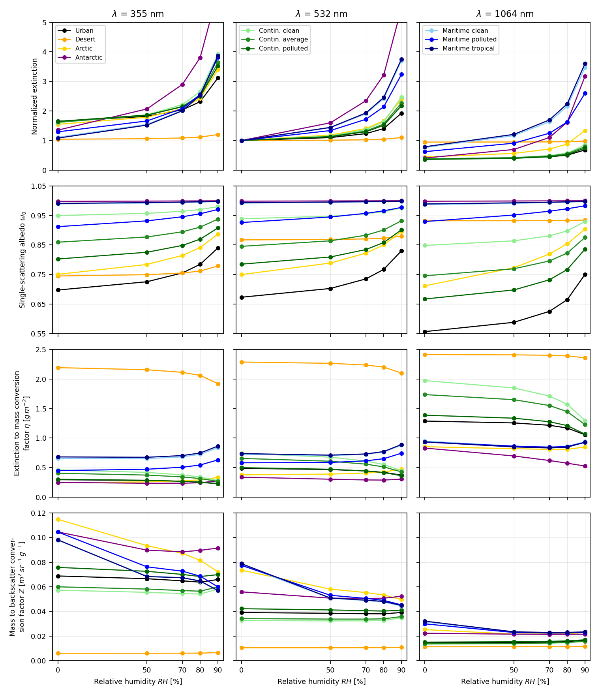
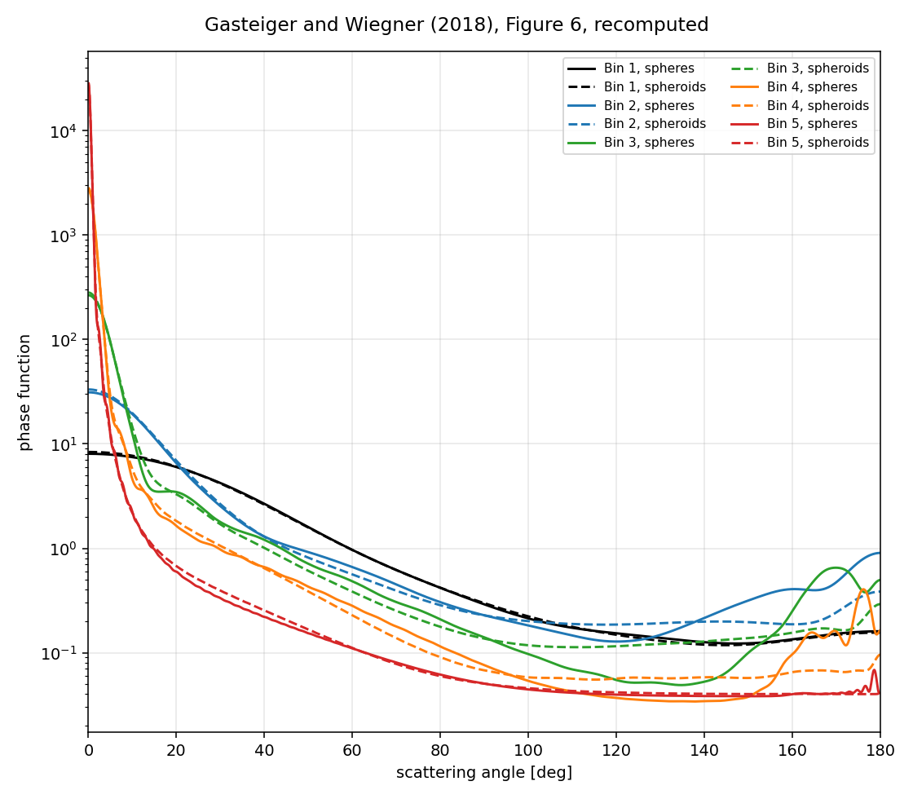
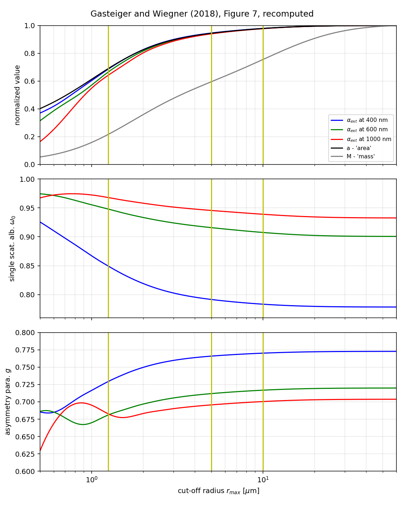
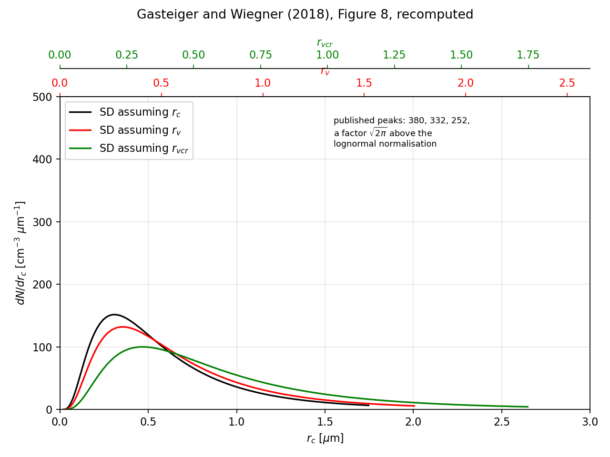
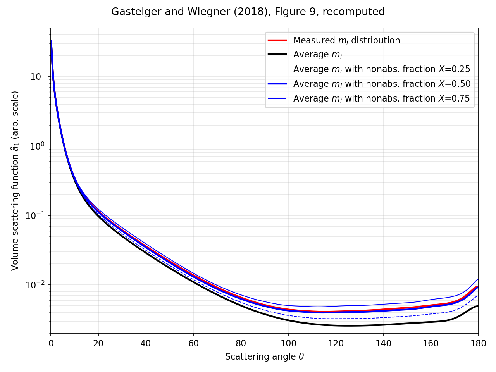
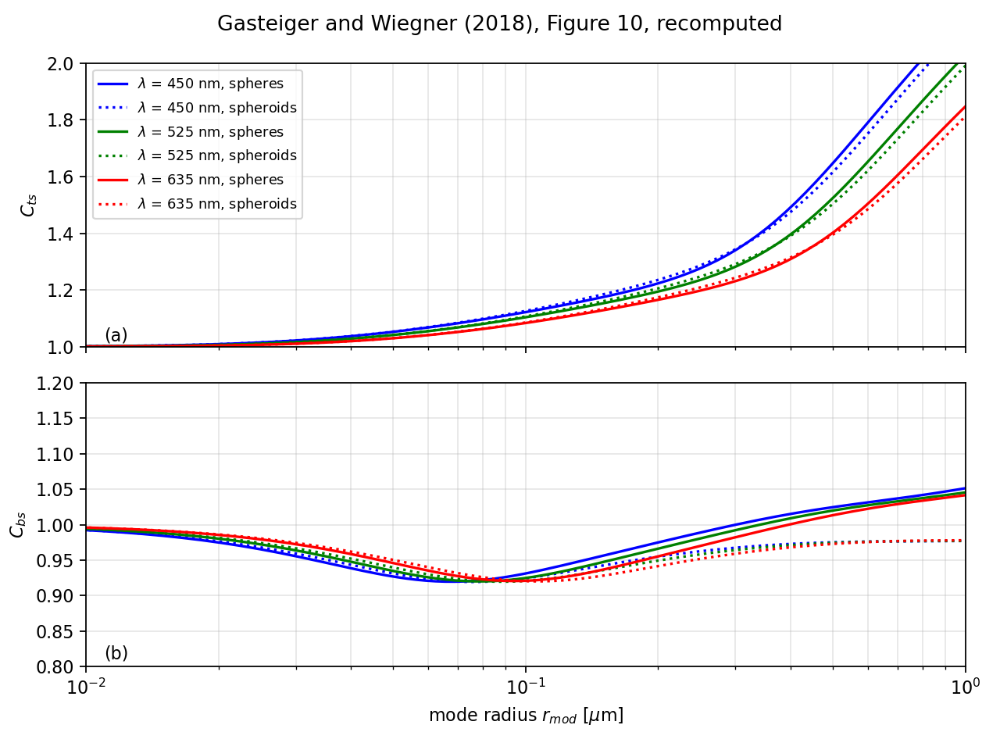
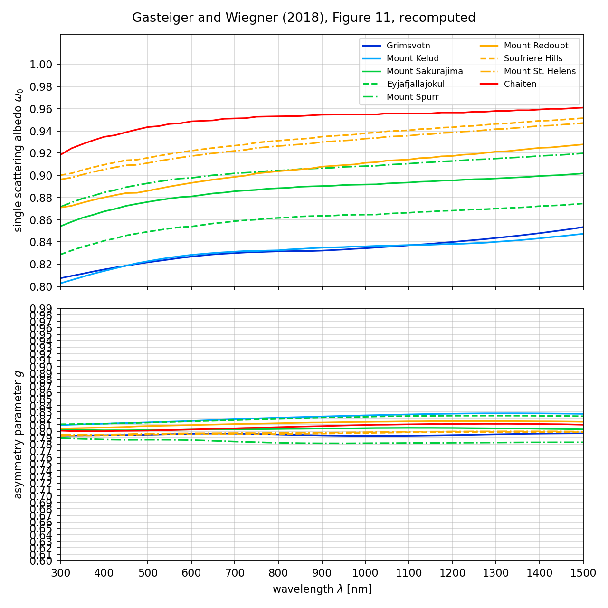

# Reproducing Gasteiger and Wiegner (2018)

> Gasteiger, J. and Wiegner, M., *MOPSMAP v1.0: a versatile tool for the
> modeling of aerosol optical properties*, Geosci. Model Dev. 11, 2739-2762,
> 2018. [doi:10.5194/gmd-11-2739-2018](https://doi.org/10.5194/gmd-11-2739-2018)

Nine figures and four tables of the article, recomputed through this wrapper.
A published number that comes back out of it is evidence that nothing was
shifted between the launch file and the result.

## What is reproduced

| | Target | Agreement |
|---|---|---|
| Fig. 2 | single particles against size parameter, five shapes | the two values the text quotes, to 1e-3 |
| Fig. 4 | size sampling and refractive index interpolation | spheres, against `miepython` |
| Fig. 5 | the ten OPAC types against humidity | curve by curve, read at 600 dpi |
| Fig. 6 | phase functions of five dust size bins | the 40 values of Table 4, to 6e-4 |
| Fig. 7 | the OPAC desert type against the cutoff radius | the six percentages of section 5.3 |
| Fig. 8 | one size distribution, three size equivalences | the conversion the text gives |
| Fig. 9 | dust against the variability of its imaginary index | the 11 values of section 5.6, to 1e-3 |
| Fig. 10 | nephelometer truncation correction | the three statements of section 5.7 |
| Fig. 11 | nine volcanic ashes | the five statements of section 5.8 |
| Table 3 | one lognormal mode, two refractive indices | 20 values, to 1.5e-3 |
| Table 4 | the five COSMO-MUSCAT dust bins | 20 values, to 1.5e-3 |
| Table 5 | the three size equivalences | 40 values, six digits against the authors' own reference runs |
| Table 6 | the Jacobian of a dust ensemble | 3 values to 1.5e-3, 9 derivatives to 0.1 |

Figures 1 and 3 are diagrams. The tables carry more weight than the figures:
they print four significant digits, and the authors ship their own reference
runs in `bin/mopsmap/misc/paper_examples/`, which carry six.

`tests/validation/test_mie_reference.py` adds the one check that does not go
through the MOPSMAP data set at all: the same ensembles computed with
`miepython`, agreeing to 3e-3.

## Running it

Both archives of the optical data set are needed; soot reaches a real
refractive index of 1.75, past the 1.64 the main one covers.

```bash
export PYMOPSMAP_DATASET_SOURCE=/path/to/optical_dataset
pixi run -e dev test-validation                       # the tables
pixi run -e dev python -m scripts.validation.gasteiger_fig5   # a figure
```

Each figure script prints the published values beside its own.

## The figures

### Figure 2, single particles



m = 1.56 + 0.00215i, a grid point of the data set, so nothing is interpolated.
The albedo peaks at 0.9917 against "about 0.991", and at xc = 1000 the spheres
and spheroids give 0.5516, 0.5518 and 0.5549 against "about 0.551". The
irregular curves stop at xc = 30.2, where Table 2 says their coverage ends.

### Figure 4, the sampling and interpolation error



Panels (b) and (d) are complete: the four grid points around m = 1.54 + 0.005i,
the value MOPSMAP interpolates there, and `miepython` on the same size grid.
Panels (a) and (c) show the spheres; their second pair of curves is a T-matrix
calculation at a resolution finer than the data set holds.

### Figure 5, the OPAC types against humidity



The article tabulates none of these values, so the comparison is made panel by
panel against the published figure. The single-scattering albedo at 532 nm and
RH = 0:

| type | published | computed |
|---|---|---|
| urban | 0.673 | 0.6731 |
| continental polluted | 0.785 | 0.7851 |
| continental average | 0.845 | 0.8453 |
| desert | 0.867 | 0.8672 |
| arctic | 0.749 | 0.7499 |
| maritime polluted | 0.927 | 0.9260 |
| continental clean | 0.939 | 0.9388 |

Two properties of the OPAC ensembles had to be taken from the MOPSMAP user
guide rather than from OPAC itself, and the catalogue this package ships now
follows it: the mineral components are prolate spheroids with the aspect ratio
distribution of Kandler et al. (2009), per section 4.2 of the guide, and the
coarse sea salt mode is cut at 20 um. At 60 um it exceeds the size parameter
the data set covers at 355 nm, where the figure plots it.

### Figure 6, five dust size bins



Section 5.2 fixes every input: bin edges at 0.1, 0.3, 0.9, 2.6, 8 and 24 um,
constant dv/dlnr within each bin, m = 1.53 + 0.0078i, volume-equivalent sizes
for the spheroids. The forty values of Table 4 come back within 6e-4.

### Figure 7, the desert type against the cutoff radius



The authors ship the script that makes this figure, so the four modes, their
concentrations and their shapes are known rather than inferred.

| | published | computed |
|---|---|---|
| PM10 mass | 59.5 % | 59.5 % |
| PM2.5 mass | 21.6 % | 21.6 % |
| PM10 cross section | 94.4 % | 94.4 % |
| PM2.5 cross section | 69.0 % | 69.0 % |
| cross section at rmax = 10 um | 97.8 % | 97.8 % |
| mass at rmax = 10 um | 75.6 % | 75.5 % |
| PM2.5 raises omega_0 by | 0.035 to 0.071 | 0.0352 to 0.0708 |
| PM2.5 lowers g by | 0.02 to 0.04 | 0.021 to 0.0434 |

### Figure 8, the three size equivalences



No MOPSMAP run: the figure shows what `size_equ` means before any optics. The
shapes, the crossings and the three cutoffs match, and the conversion the text
spells out comes back exactly, 0.757 um.

The vertical scale differs. The published peaks are 380, 332 and 252
cm-3 um-1, where the lognormal of `log_distr.f90` at the concentration Table 5
uses gives 151.7, 132.1 and 100.2, a ratio of 2.504, 2.513 and 2.515 against
sqrt(2 pi) = 2.5066.

### Figure 9, the variability of the imaginary index



The red curve carries the size-resolved index distribution of Kandler et al.
(2011), Appendix S1, which has to be fetched from the publisher;
`KANDLER_DATA` points the script at it. Its average comes out at 0.01746
against the 0.0175 section 5.6 gives.

| | published | computed |
|---|---|---|
| omega_0, average m_i | 0.741 | 0.7401 |
| omega_0, X = 0.5 | 0.834 | 0.8341 |
| g, measured / average / X = 0.5 | 0.744 / 0.789 / 0.749 | 0.7437 / 0.7895 / 0.7488 |
| S, measured / average / X = 0.5 | 41 / 78 / 42 sr | 40.70 / 78.35 / 41.96 sr |
| delta_l, measured / average / X = 0.5 | 0.241 / 0.212 / 0.220 | 0.2411 / 0.2114 / 0.2201 |

### Figure 10, the nephelometer truncation



| statement of section 5.7 | computed |
|---|---|
| "underestimates total scattering by a factor of ~ 2" at rmod = 1 um | 2.16, 2.01, 1.83 |
| shape effect on Cts "less than 3 %" | 2.2 % |
| "The maximum shape effect on Cbs is 7 %" | 7.0 % |

### Figure 11, nine volcanic ashes



Each measured particle of Vogel et al. (2017) becomes a prolate spheroid of
its own size and aspect ratio, nine to thirty thousand modes per volcano. The
measurements are that article's supporting information, fetched from the
publisher; `VOGEL_DATA` points the script at it.

| statement of section 5.8 | computed |
|---|---|
| omega_0 spans "up to about 0.12" | 0.122 |
| it rises "typically by about 0.05" | 0.048 |
| variability in g "less than 0.05" | 0.014 |
| its change with wavelength "less than 0.02" | 0.018 |
| effective radii "from 9.5 to 21 um" | 9.5 to 21.0 |

Chaiten comes out the least absorbing, as the article says. The most absorbing
comes out as Grimsvotn rather than Mount Kelud; the two curves overlap, 0.807
against 0.803 at 300 nm.

## Inputs taken from elsewhere

Three quantities the figures need are not stated, or are stated twice. What
follows is what was used and why.

**Table 3 gives no concentration.** Its extinction coefficients are reproduced
with N = 1000 cm-3; the other four rows do not depend on it.

**Section 5.4 gives two.** It writes "N0 = 10^3.66 cm-3, which results in a
concentration of N = 100 cm-3 in the range from rmin to rmax". The lognormal
of `log_distr.f90` puts 96.46 % of its particles inside that range, so the two
differ by a factor of 44. The in-range concentration is the one that
reproduces the table, and MOPSMAP echoes it back as n = 100.0.

**The reference runs in `sect_54_size_equivalence/` carry a factor 1e-6.**
Their concentration is in cm-3 where MOPSMAP reads m-3, so every extensive
quantity in them sits below the published table by that factor. The test
applies it rather than alter the shipped expectations.
